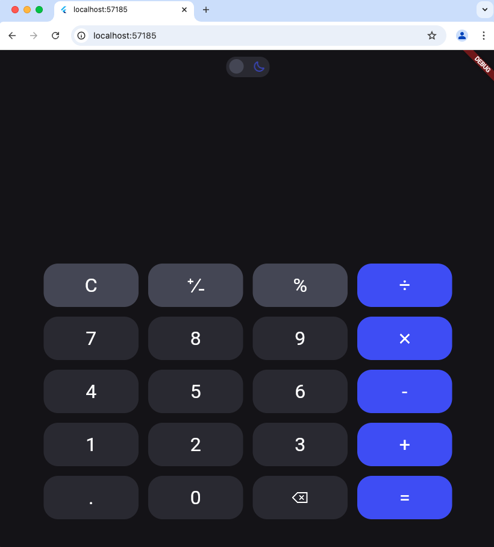

# flutter_caculator

A new Flutter project. using Flutter 3.27.1.

## Getting Started
How to dev
type this command in terminal
```sh
    chmod +x runner.sh
    ./runner.sh
```
using this command when you want to add some assets (image, font,, etc.)
```sh
  flutter pub run build_runner build --delete-conflicting-outputs
```
## Image Preview





